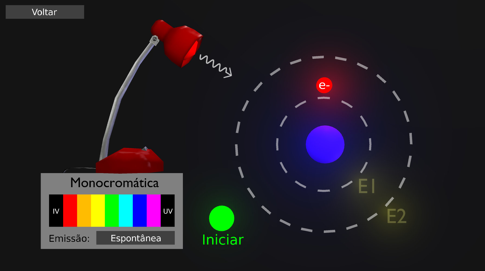

# Interação de radiação com a matéria

Simulação interativa de interação de radiação com a matéria feita no Blender Game Engine.

## Créditos
- Joel Gomes da Silva
- Luciana da Cruz Barros
- Mateus Gomes Lima (Supervisão)
